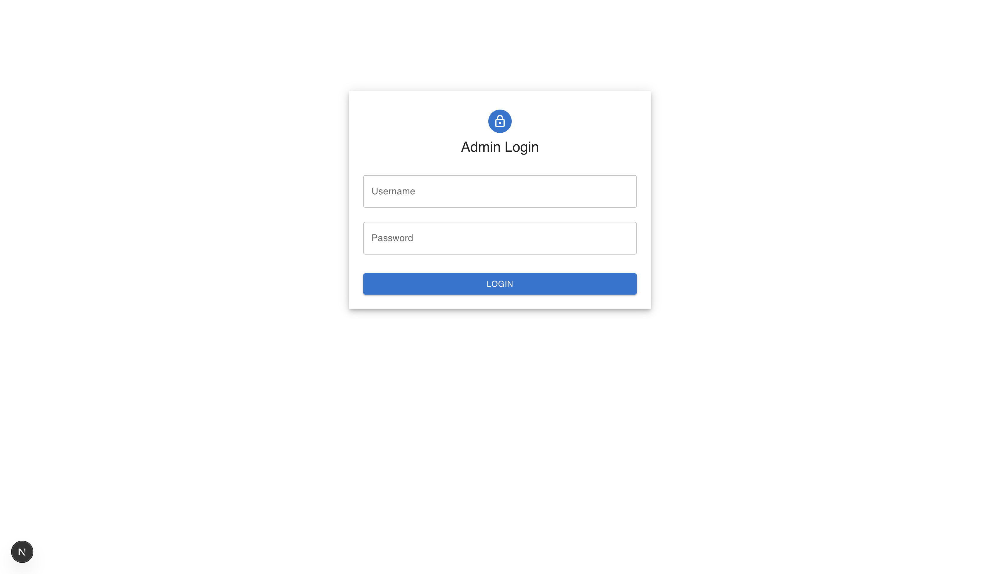
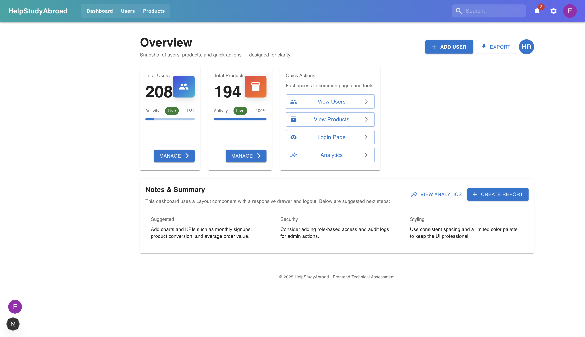
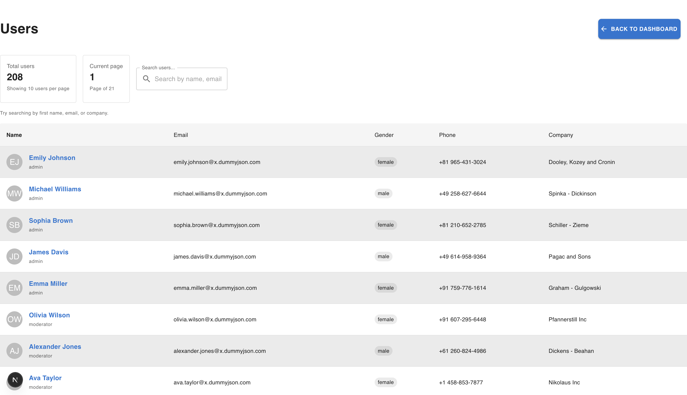
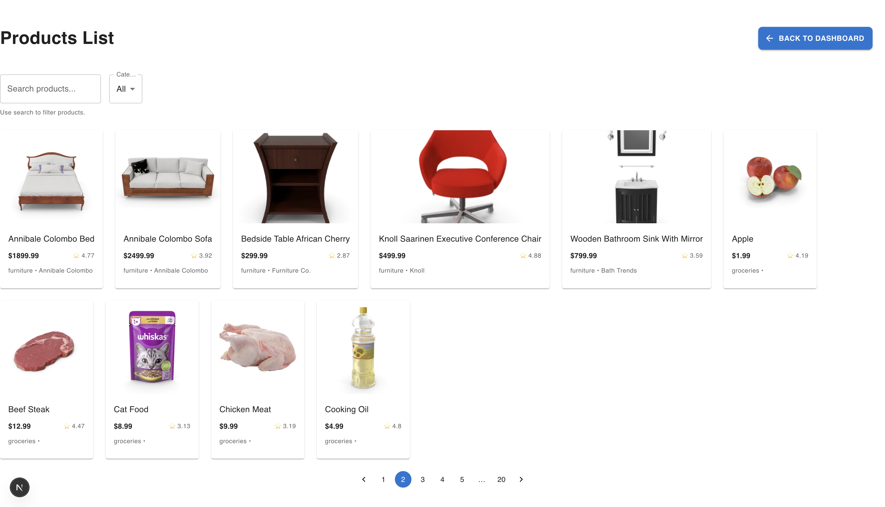
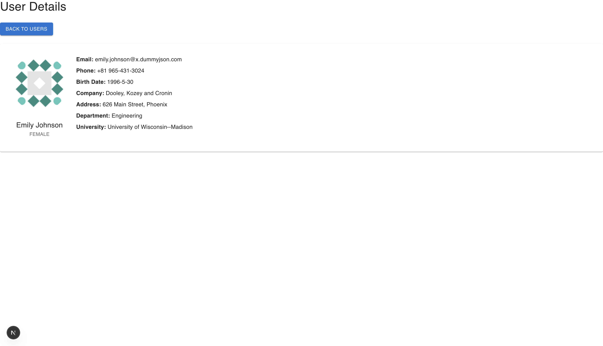
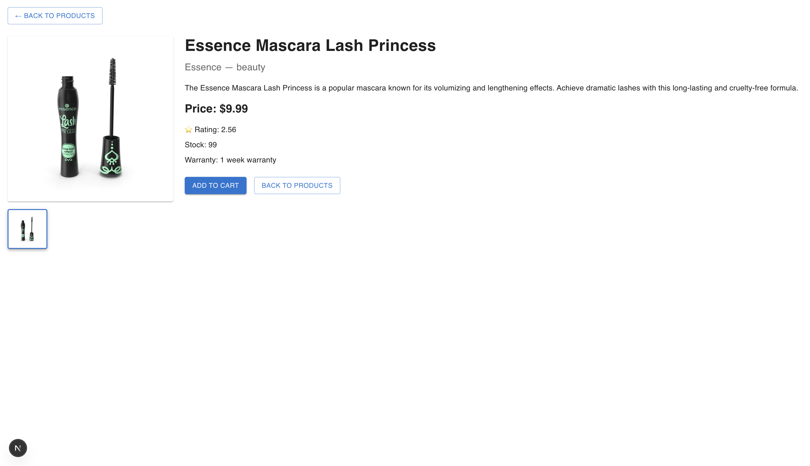
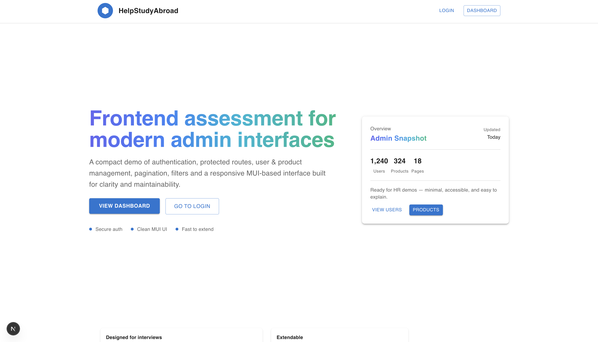

## Shorter HR Version (if needed)

A fully responsive, modern admin dashboard built with Next.js, MUI, Zustand, and DummyJSON APIs. The project includes authentication, protected routing, users/products management, pagination, search, filtering, and detailed pages. I focused on clean code, strong architecture, and professional UI/UX while implementing caching, performance optimizations, and scalable state management.


## Project Architecture (Based on Your Actual Project Structure)
HELP-STUDY-ABROAD-ASSIGNMENT/
│
├── public/                         # Public assets served by Next.js
│   ├── images/                     # Static images used in the project
│   └── screenshots/                # UI screenshots for README documentation
│       ├── dashboard.png
│       ├── Home.png
│       ├── login.png
│       ├── product-details.png
│       ├── products-list.png
│       ├── user-details.png
│       └── users-list.png
│
├── src/
│   ├── components/                 # Reusable UI components
│   │   ├── Layout.js               # Main layout with sidebar + topbar
│   │   ├── ProductCard.js          # Product grid card component
│   │   └── ProtectedRoute.js       # Route protection wrapper
│   │
│   ├── lib/
│   │   └── api.js                  # API helper (optional abstraction layer)
│   │
│   ├── pages/                      # All front-facing pages (Next.js routing)
│   │   ├── api/                    # API endpoints handled by Next.js
│   │   │   ├── auth/
│   │   │   │   ├── [...nextauth].js# NextAuth authentication configuration
│   │   │   │   ├── proxy-login.js  # Custom auth proxy for DummyJSON login
│   │   │   │   └── hello.js        # Test API route
│   │   │   ├── products/
│   │   │   │   ├── [id].js         # Product detail API (optional proxy)
│   │   │   │   └── index.js        # Products API proxy
│   │   │   └── users/
│   │   │       ├── [id].js         # User detail API proxy
│   │   │       └── index.js        # Users API proxy
│   │   │
│   │   ├── dashboard.js            # Main dashboard screen
│   │   ├── index.jsx               # Landing page (Hero UI)
│   │   ├── login.js                # Admin login screen
│   │   ├── products/
│   │   │   ├── [id].js             # Single product view
│   │   │   └── index.js            # Product listing page
│   │   └── users/
│   │       ├── [id].js             # Single user view
│   │       └── index.js            # Users list page
│   │
│   ├── store/                      # Zustand global state stores
│   │   ├── useAuthStore.js         # Authentication state + token management
│   │   ├── useProductsStore.js     # Products data, search, filters, pagination
│   │   └── useUsersStore.js        # Users data, search, pagination
│   │
│   ├── styles/                     # Global and module-specific styles
│   │   ├── globals.css             # Global CSS reset + typography
│   │   └── Home.module.css         # Styles for landing page hero section
│   │
│   ├── _app.js                     # Custom Next.js root app wrapper
│   └── _document.js                # Custom HTML document structure
│
├── .env.local                      # Local environment variables
├── .gitignore
├── eslint.config.mjs
├── jsconfig.json
├── package.json
├── package-lock.json
├── next.config.mjs
└── README.md                       # Full documentation


## Documentation










## Live Features Overview
## Authentication

Secure login using DummyJSON Auth API

Session handled using NextAuth

Token stored safety using Zustand + NextAuth session

Protected routes (Dashboard, Users, Products)

## Users Module

Paginated users list (limit/skip API pagination)

Search capability using query API

Responsive MUI table + Card layout

Single user detail page with clean layout

## Products Module

Paginated products list

Search + category filter

Product cards with image, price, rating

Detailed product page with carousel, description, specs

## State Management (Zustand)

Global auth state

Users state

Products state

Built-in async actions for calling REST APIs

Local caching to prevent repeated API requests

## UI/UX

Fully responsive Material-UI design

Light modern layout with sidebar + top navigation

Smart skeleton loaders

Professional cards, tables, grids

Gradient typography + modern color theme


## Tech Stack
Framework

Next.js (React-based SSR/CSR hybrid)

UI Library

Material-UI (MUI v5)

State Management

Zustand (lightweight & scalable global store)

Authentication

NextAuth

DummyJSON auth API

REST API

## https://dummyjson.com/


## Installation & Setup
## Clone Repository
git clone <your-repo-url>
cd help-study-abroad-frontend

## Install Dependencies
npm install

## Add Environment Variables

Create a .env.local file:

## NEXTAUTH_SECRET=your-secret-key
## NEXTAUTH_URL=http://localhost:3000


Optional for custom token handling:

AUTH_TOKEN_SECRET=my-local-token-key

## Running the App
Development
npm run dev


Your app starts at:

## http://localhost:3000

Production
npm run build
npm start

## Why Zustand? (Short & Professional)

Zustand was chosen because:

It is extremely lightweight yet powerful

Built-in async actions make API calls clean and simple

No reducers, boilerplate, or complex setup like Redux

Perfect for small-to-medium applications

Global state is easy to reason about and debug

Minimal re-renders thanks to Zustand’s selector-based updates

This makes Zustand ideal for an assessment requiring clarity + speed.


## Performance Optimizations

The following optimizations were implemented:

## API-side pagination

Prevents fetching large lists at once.

## useMemo / useCallback

Used in lists, filters, and computed values.

## React.memo

Used for ProductCard and other repeat-render components.

## Zustand caching

Users and products data stored in state to avoid refetching when returning to pages.

## Skeleton loading

Provides smooth UX without layout shift.


## Caching Strategy
## What is cached?

Users list

Products list

Last-used pagination & filters

## Why caching?

Reduces unnecessary network calls

Improves page transition performance

Makes UI feel instant when revisiting pages

## How it works?

Zustand store retains previous results

When user navigates back, data loads instantly from memory

API re-fetches only when filters or pages change

## Submission

Once complete:

Push code to a public GitHub repository

Include this README

Share your GitHub link via email or message

## Final Note

This project demonstrates the core skills required for modern admin dashboards:

Clean architecture

Strong React/Next.js foundations

Scalable global state

Practical API integration

Professional UI/UX

This is a [Next.js](https://nextjs.org) project bootstrapped with [`create-next-app`](https://nextjs.org/docs/pages/api-reference/create-next-app).

## Getting Started

First, run the development server:

```bash
npm run dev
# or
yarn dev
# or
pnpm dev
# or
bun dev
```

Open [http://localhost:3000](http://localhost:3000) with your browser to see the result.

You can start editing the page by modifying `pages/index.js`. The page auto-updates as you edit the file.

[API routes](https://nextjs.org/docs/pages/building-your-application/routing/api-routes) can be accessed on [http://localhost:3000/api/hello](http://localhost:3000/api/hello). This endpoint can be edited in `pages/api/hello.js`.

The `pages/api` directory is mapped to `/api/*`. Files in this directory are treated as [API routes](https://nextjs.org/docs/pages/building-your-application/routing/api-routes) instead of React pages.

This project uses [`next/font`](https://nextjs.org/docs/pages/building-your-application/optimizing/fonts) to automatically optimize and load [Geist](https://vercel.com/font), a new font family for Vercel.

## Learn More

To learn more about Next.js, take a look at the following resources:

- [Next.js Documentation](https://nextjs.org/docs) - learn about Next.js features and API.
- [Learn Next.js](https://nextjs.org/learn-pages-router) - an interactive Next.js tutorial.

You can check out [the Next.js GitHub repository](https://github.com/vercel/next.js) - your feedback and contributions are welcome!

## Deploy on Vercel

The easiest way to deploy your Next.js app is to use the [Vercel Platform](https://vercel.com/new?utm_medium=default-template&filter=next.js&utm_source=create-next-app&utm_campaign=create-next-app-readme) from the creators of Next.js.

Check out our [Next.js deployment documentation](https://nextjs.org/docs/pages/building-your-application/deploying) for more details.

